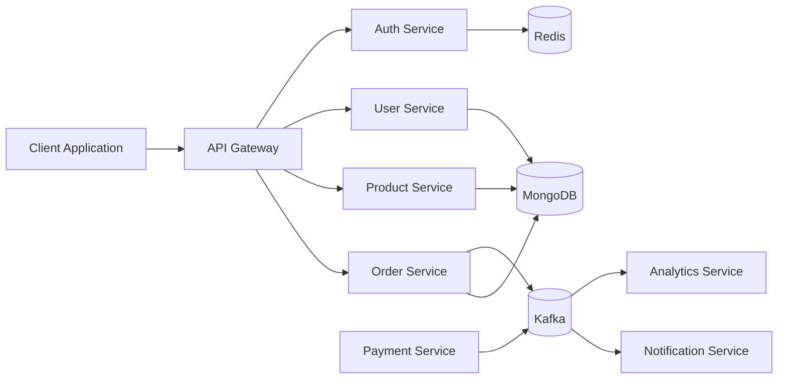
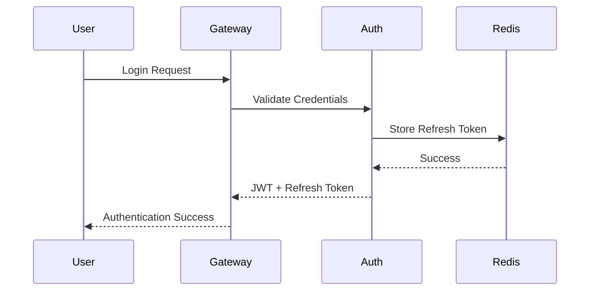
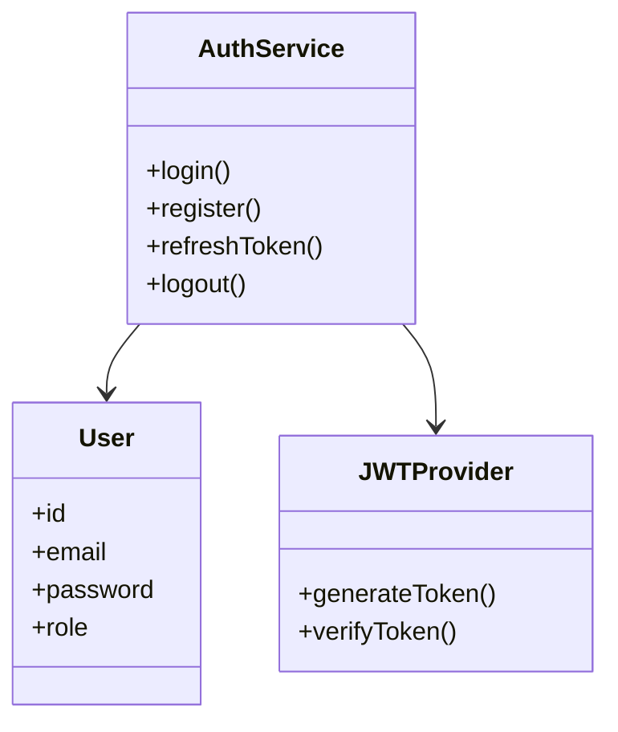
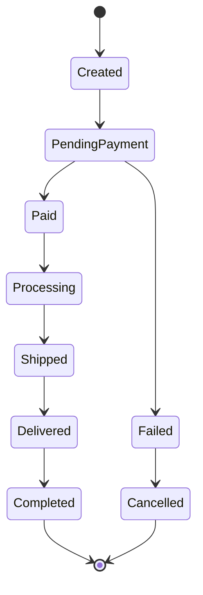
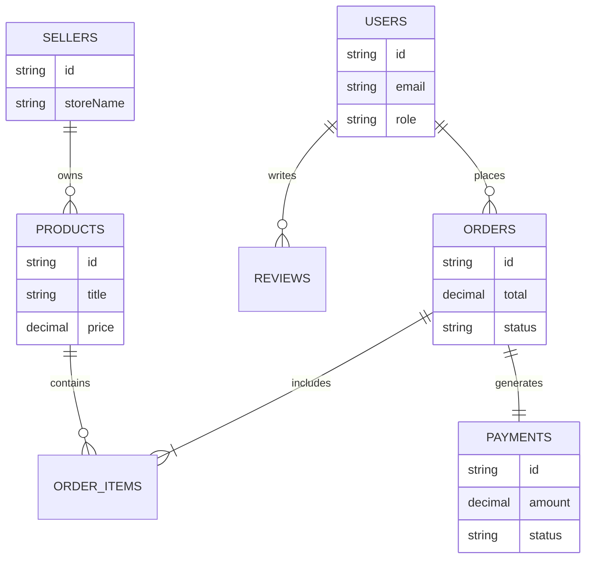
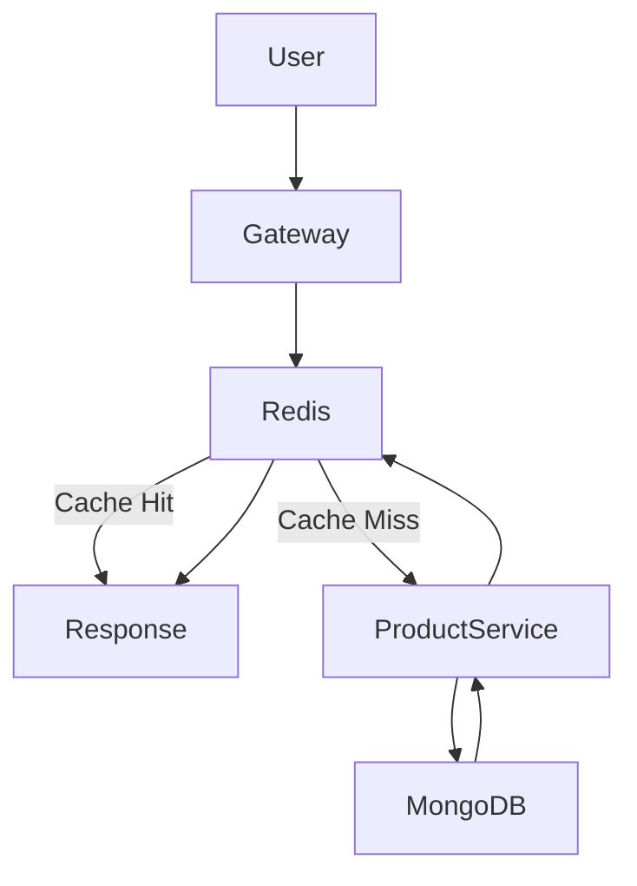
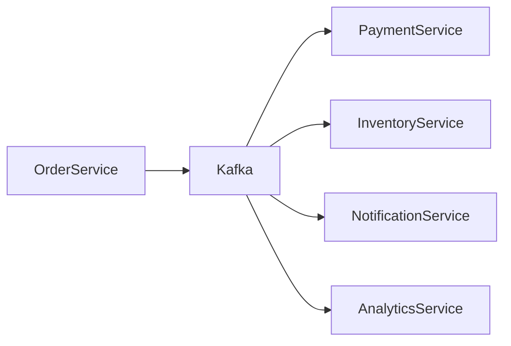
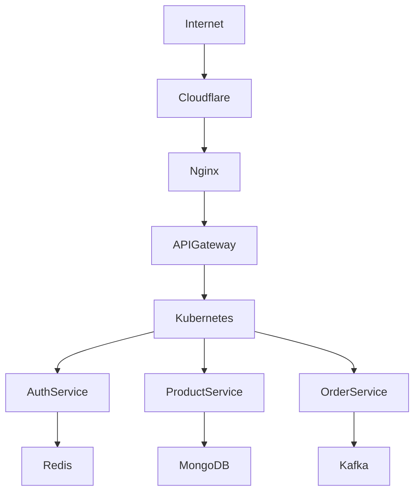
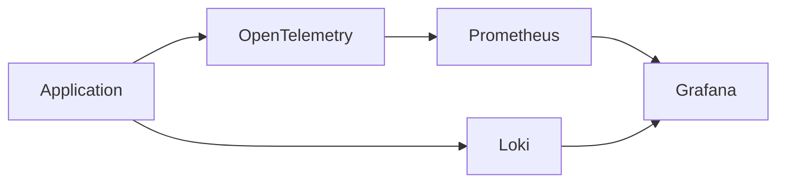
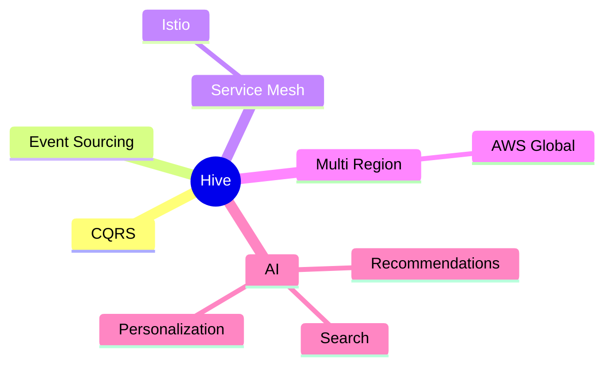

# Building Hive: Designing a Scalable Multi-Vendor E-Commerce Platform

> A deep dive into the architecture, engineering decisions, distributed systems patterns, and scalability strategies behind Hive.

---

## Executive Summary

Hive is a cloud-native multi-vendor e-commerce SaaS platform designed around microservices, event-driven architecture, and distributed systems principles.

### Project Goals

| Goal               | Why It Matters                                |
| ------------------ | --------------------------------------------- |
| Scalability        | Support growth without rewriting architecture |
| Reliability        | Avoid single points of failure                |
| Observability      | Enable production debugging                   |
| Extensibility      | Add new services independently                |
| Developer Velocity | Faster deployments and ownership              |

---

## System Overview

### Core Services

| Service           | Responsibility     |
| ----------------- | ------------------ |
| API Gateway       | Request Routing    |
| Auth Service      | Authentication     |
| User Service      | User Profiles      |
| Seller Service    | Seller Operations  |
| Product Service   | Catalog Management |
| Cart Service      | Shopping Cart      |
| Order Service     | Order Lifecycle    |
| Payment Service   | Stripe Integration |
| Analytics Service | Reporting          |

---

# High Level Architecture



---

# Authentication Flow



---

## Auth Service Class Diagram



---

# Order Lifecycle State Diagram



---

# Entity Relationship Diagram



---

# Product Discovery Flow



---

## Example Redis Cache Strategy

### Product Cache

```redis
product:123
product:456
product:789
```

### Popular Products

```redis
popular_products
```

---

# Kafka Event Flow



---

## Kafka Event Payload

```json
{
  "event": "ORDER_CREATED",
  "orderId": "12345",
  "userId": "user_001",
  "totalAmount": 4999,
  "timestamp": "2026-01-15T12:00:00Z"
}
```

---

# Deployment Architecture



---

# Sample Backend Code (Node.js)

```ts
import express from "express";

const app = express();

app.get("/health", (_, res) => {
  res.status(200).json({
    status: "healthy",
  });
});

app.listen(3000);
```

---

# Sample Kafka Producer (Java)

```java
ProducerRecord<String, String> record =
    new ProducerRecord<>(
        "orders",
        orderId,
        payload
    );

producer.send(record);
```

---

# Sample DSA Utility (C++)

```cpp
#include <iostream>
#include <vector>

using namespace std;

int main() {
    vector<int> orders = {1,2,3};

    for(auto order : orders){
        cout << order << endl;
    }

    return 0;
}
```

---

# Sample Analytics Query (SQL)

```sql
SELECT
    DATE(created_at),
    COUNT(*)
FROM orders
GROUP BY DATE(created_at)
ORDER BY DATE(created_at);
```

---

# Observability

Production systems require visibility.

## Metrics

| Metric             | Description         |
| ------------------ | ------------------- |
| API Latency        | Request Performance |
| Error Rate         | Reliability         |
| Kafka Consumer Lag | Event Health        |
| Redis Hit Ratio    | Cache Effectiveness |
| Order Throughput   | Business KPI        |

---

## Monitoring Stack



---

# Challenges

## Distributed Transactions

Multiple services participate in a single order workflow.

Instead of distributed locks, Hive uses:

* Event Driven Communication
* Eventual Consistency
* Retry Mechanisms
* Dead Letter Queues

---

## Scaling Read Traffic

Challenges:

* Product search
* Product details
* Recommendations

Solution:

* Redis Caching
* CDN
* Database Indexing

---

# Results

### Architecture Achievements

* Microservices Architecture
* Kafka Event Streaming
* Distributed Caching
* Stripe Marketplace Payments
* Cloud Native Deployment
* Horizontal Scalability

---

# Future Improvements



---

# Key Learnings

Building Hive reinforced an important lesson:

> Scalability is not achieved by adding more servers. It is achieved through thoughtful architecture, clear service boundaries, reliable communication patterns, and strong observability.

The project significantly improved my understanding of:

* Distributed Systems
* Event Driven Architecture
* Cloud Native Engineering
* Platform Design
* Production Operations
* Observability Engineering
* Scalable Backend Systems
